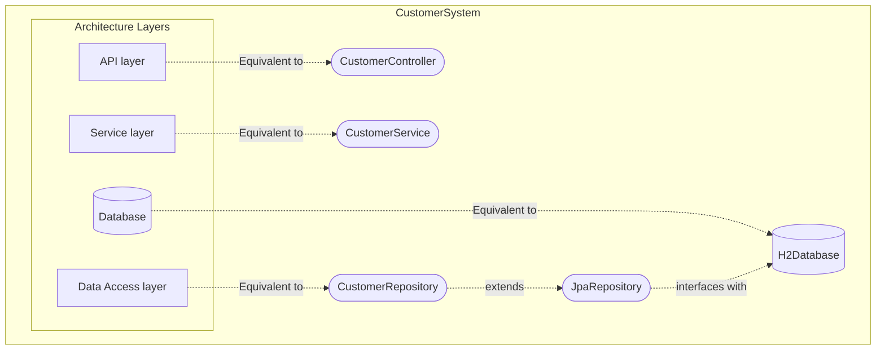
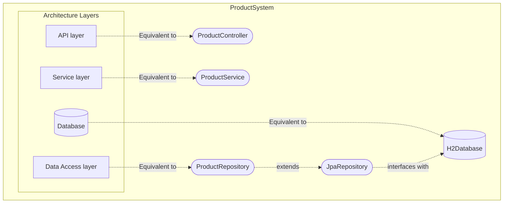
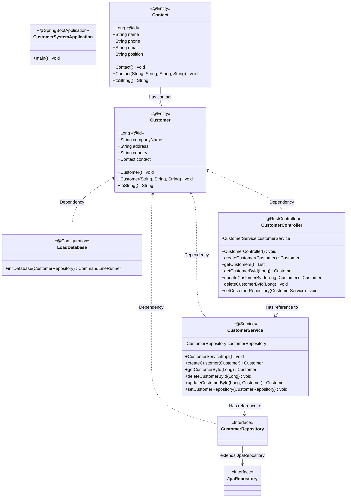
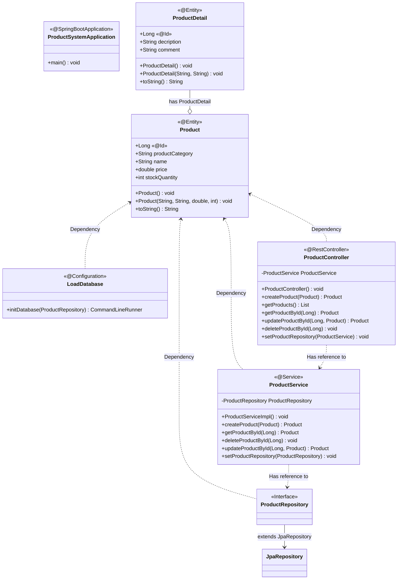

# csci318 Project

Online Ordering Application using a microservices architecture in Java Spring Boot.

 &nbsp;
&nbsp;
&nbsp;
&nbsp;
&nbsp;
&nbsp;
&nbsp;

### Group Members

| Member          | id    |
| --------------- | ----- |
| Paul Sinnreich  | ps484 |
| Michael Kilbane | mk507 |
| Akhil Ameer     | aa541 |

---

### Instructions to Build and Run

Build: `cd [service-name]; ./mvnw compile -f "pom.xml";`

Run: `honcho start;`

- Honcho required as a dependency. To install: `pip install honcho;`
- Building compiles a fat jar to `/target/<system-name>System-<version>-SNAPSHOT.jar`

---

### Demonstration of Use-Cases

| Link                         | Use Case                              | Service  |
| ---------------------------- | ------------------------------------- | -------- |
| [UseCase 1](#use-case-1)     | Create Customer/Contact               | Customer |
| [UseCase 2](#use-case-2)     | Update Customer/Contact               | Customer |
| [UseCase 3.1](#use-case-3-1) | Get Customer/Contact info             | Customer |
| [UseCase 3.2](#use-case-3-2) | Get ALL Customer/Contact info         | Customer |
| [UseCase 4](#use-case-4)     | Create Product/Detail                 | Product  |
| [UseCase 5](#use-case-5)     | Update Product/Detail                 | Product  |
| [UseCase 6.1](#use-case-6-1) | Get Product/Detail info               | Product  |
| [UseCase 6.2](#use-case-6-2) | Get ALL Product/Detail info           | Product  |
| [UseCase 7](#use-case-7)     | Create Purchase                       | Purchase |
| [UseCase 8](#use-case-8)     | Get Customer/Product info by Purchase | Purchase |

---

<a name="use-case-1"></a>

#### Use Case 1: Create Customer/Contact

```bash
curl -X POST -H "Content-Type:application/json" -d \
'[JSON]' http://localhost:8080/customers
```

- where `JSON` is a JSON stringified customer object, to be added to the system

<br/>

**EXAMPLE:** Add `Google` as a new customer

```bash
curl -X POST -H "Content-Type:application/json" -d \
'{"companyName":"Google",
"address":"1600 Amphitheatre Parkway, Mountain View, California",
"country":"USA","contact":{"name": "Test Testerson","phone": "0400000000",
"email": "mail@example.com", "position": "CEO"}}' http://localhost:8080/customers
```

```bash
curl -X GET http://localhost:8080/customers
```

```JSON
[
  {
    "id": 1,
    "companyName": "Apple",
    "address": "1 Apple Park Way, Cupertino, CA 95014",
    "country": "USA",
    "contact": {
      "id": 2,
      "name": "Tim Apple",
      "phone": "123456",
      "email": "tim@apple.com",
      "position": "CEO"
    }
  },
  {
    "id": 3,
    "companyName": "SpaceX",
    "address": "42 Galactic Drive, San Francisco, CA 97468",
    "country": "USA",
    "contact": {
      "id": 4,
      "name": "Elon Musk",
      "phone": "69420",
      "email": "elon@spacex.com",
      "position": "CEO"
    }
  },
  {
    "id": 5,
    "companyName": "Google",
    "address": "1600 Amphitheatre Parkway, Mountain View, California",
    "country": "USA",
    "contact": {
      "id": 6,
      "name": "Test Testerson",
      "phone": "0400000000",
      "email": "mail@example.com",
      "position": "CEO"
    }
  }
]
```

---

<a name="use-case-2"></a>

#### Use Case 2: Update exisiting Customer/Contact

```bash
curl -X PUT -H "Content-Type:application/json" -d \
'[JSON]' http://localhost:8080/customers/[id]
```

- where `id` is the id of the customer
- where `JSON` is a JSON stringified customer object(Optionally with nested contact), to be updated in the system

<br/>

**EXAMPLE:** Update customer contact name of customer with id `1` from Tim **Apple** to Tim **Cook**

```bash
curl -X GET http://localhost:8080/customers/1
```

```JSON
{
  "id": 1,
  "companyName": "Apple",
  "address": "1 Apple Park Way, Cupertino, CA 95014",
  "country": "USA",
  "contact": {
    "id": 2,
    "name": "Tim Apple",
    "phone": "123456",
    "email": "tim@apple.com",
    "position": "CEO"
  }
}
```

```bash
curl -X PUT -H "Content-Type:application/json" -d \
'{"companyName": "Apple","address": "1 Apple Park Way, Cupertino, CA 95014",
"country": "USA", "contact": {"id": 2,"name": "Tim Cook","phone": "123456",
"email": "tim@apple.com", "position": "CEO}}' http://localhost:8080/customers/1
```

```bash
curl -X GET http://localhost:8080/customers/1
```

```JSON
{
  "id": 1,
  "companyName": "Apple",
  "address": "1 Apple Park Way, Cupertino, CA 95014",
  "country": "USA",
  "contact": {
    "id": 2,
    "name": "Tim Cook",
    "phone": "123456",
    "email": "tim@apple.com",
    "position": "CEO"
  }
}
```

---

<a name="use-case-3-1"></a>

#### Use Case 3.1: Get Customer/Contact info

```bash
curl -X GET http://localhost:8080/customers/[id]
```

- where `id` is the id of the customer

<br/>

**EXAMPLE:** Return customer with id `1`

```bash
curl -X GET http://localhost:8080/customers/1
```

```JSON
{
  "id": 1,
  "companyName": "Apple",
  "address": "1 Apple Park Way, Cupertino, CA 95014",
  "country": "USA",
  "contact": {
    "id": 2,
    "name": "Tim Apple",
    "phone": "123456",
    "email": "tim@apple.com",
    "position": "CEO"
  }
}
```

---

<a name="use-case-3-2"></a>

#### Use Case 3.2: Get ALL Customer/Contact info\

```bash
curl -X GET http://localhost:8080/customers
```

<br/>

**EXAMPLE:**

```bash
curl -X GET http://localhost:8080/customers
```

```JSON
[
  {
    "id": 1,
    "companyName": "Apple",
    "address": "1 Apple Park Way, Cupertino, CA 95014",
    "country": "USA",
    "contact": {
      "id": 2,
      "name": "Tim Apple",
      "phone": "123456",
      "email": "tim@apple.com",
      "position": "CEO"
    }
  },
  {
    "id": 3,
    "companyName": "SpaceX",
    "address": "42 Galactic Drive, San Francisco, CA 97468",
    "country": "USA",
    "contact": {
      "id": 4,
      "name": "Elon Musk",
      "phone": "69420",
      "email": "elon@spacex.com",
      "position": "CEO"
    }
  }
]
```

---

<a name="use-case-4"></a>

#### Use Case 4: Create Product/Detail

```bash
curl -X POST -H "Content-Type:application/json" -d \
'[JSON]' http://localhost:8080/products
```

- where `JSON` is a JSON stringified product object, to be added to the system
  <br/>

**EXAMPLE:** Add `Packham Pear` as a new product

```bash
curl -X POST -H "Content-Type:application/json" -d \
'{"productCategory":"Fruit","name":"Packham Pear","price":0.67,
"stockQuantity":200,"productDetail":{"description":
"Crispy white juicy sweet flesh, with a beautiful green skin which turns light yellow when ripe",
"comment":"Seasonality: March - December"}}' \
http://localhost:8080/products
```

```bash
curl -X GET http://localhost:8080/products
```

```JSON
[
  {
    "id": 1,
    "productCategory": "Fruit",
    "name": "Royal Gala Apple",
    "price": 0.62,
    "stockQuantity": 200,
    "productDetail": {
      "id": 2,
      "description": "Apples are juicy, crisp and come in a variety of colours including red, pink and green.",
      "comment": "Store your apples in the fridge"
    }
  },
  {
    "id": 3,
    "productCategory": "Fruit",
    "name": "Cavendish Banana",
    "price": 0.72,
    "stockQuantity": 200,
    "productDetail": {
      "id": 4,
      "description": "Bananas are perfect for snacking, used in baking, fruit salads and smoothies.",
      "comment": "Bananas are the worlds oldest fruit!"
    }
  },
  {
    "id": 5,
    "productCategory": "Fruit",
    "name": "Packham Pear",
    "price": 0.67,
    "stockQuantity": 200,
    "productDetail": {
      "id": 6,
      "description": "Crispy white juicy sweet flesh, with a beautiful green skin which turns light yellow when ripe",
      "comment": "Seasonality: March - December"
    }
  }
]
```

---

<a name="use-case-5"></a>

#### Use Case 5: Update Product/Detail

```bash
curl -X PUT -H "Content-Type:application/json" -d \
'[JSON]' http://localhost:8080/products/[id]
```

- where `id` is the id of the product
- where `JSON` is a JSON stringified product object(Optionally with nested productDetail), to be updated in the system

<br/>

**EXAMPLE:** Update customer contact name of customer with id `1` from Tim **Apple** to Tim **Cook**

```bash
curl -X GET http://localhost:8080/customers/1
```

```JSON
{
  "id": 1,
  "companyName": "Apple",
  "address": "1 Apple Park Way, Cupertino, CA 95014",
  "country": "USA",
  "contact": {
    "id": 2,
    "name": "Tim Apple",
    "phone": "123456",
    "email": "tim@apple.com",
    "position": "CEO"
  }
}
```

```bash
curl -X PUT -H "Content-Type:application/json" -d \
'{"companyName": "Apple","address": "1 Apple Park Way, Cupertino, CA 95014",
"country": "USA", "contact": {"id": 2,"name": "Tim Cook","phone": "123456",
"email": "tim@apple.com", "position": "CEO}}' http://localhost:8080/customers/1
```

```bash
curl -X GET http://localhost:8080/customers/1
```

```JSON
{
  "id": 1,
  "companyName": "Apple",
  "address": "1 Apple Park Way, Cupertino, CA 95014",
  "country": "USA",
  "contact": {
    "id": 2,
    "name": "Tim Cook",
    "phone": "123456",
    "email": "tim@apple.com",
    "position": "CEO"
  }
}
```

---

<a name="use-case-6-1"></a>

#### Use Case 6.1: Get Product/Detail info

```bash
curl -X GET http://localhost:8080/products/[id]
```

- where `id` is the id of the product

<br/>

**EXAMPLE:** Return product with id `1`

```bash
curl -X GET http://localhost:8080/products/1
```

```JSON
{
  "id": 1,
  "productCategory": "Fruit",
  "name": "Royal Gala Apple",
  "price": 0.62,
  "stockQuantity": 200,
  "productDetail": {
    "id": 2,
    "description": "Apples are juicy, crisp and come in a variety of colours including red, pink and green.",
    "comment": "Store your apples in the fridge"
  }
}
```

---

<a name="use-case-6-2"></a>

#### Use Case 6.2: Get ALL Product/Detail info

```bash
curl -X GET http://localhost:8080/products
```

<br/>

**EXAMPLE:**

```bash
curl -X GET http://localhost:8080/products
```

```JSON
[
  {
    "id": 1,
    "productCategory": "Fruit",
    "name": "Royal Gala Apple",
    "price": 0.62,
    "stockQuantity": 200,
    "productDetail": {
      "id": 2,
      "description": "Apples are juicy, crisp and come in a variety of colours including red, pink and green.",
      "comment": "Store your apples in the fridge"
    }
  },
  {
    "id": 3,
    "productCategory": "Fruit",
    "name": "Cavendish Banana",
    "price": 0.72,
    "stockQuantity": 200,
    "productDetail": {
      "id": 4,
      "description": "Bananas are perfect for snacking, used in baking, fruit salads and smoothies.",
      "comment": "Bananas are the worlds oldest fruit!"
    }
  }
]
```

---

<a name="use-case-7"></a>

#### Use Case 7: Create Purchase

```bash
curl -X POST -H "Content-Type:application/json" -d \
'{"quantity":[QTY],"productID":[PID], "customerID":[CID]}' \
http://localhost:8080/purchases/new
```

- where `QTY` is the amount of products purchased
- where `PID` is the id of the product
- where `CID` is the id of the customer

<br/>

**EXAMPLE:** Add a new purchase of `1` units, of product with id `1`, by customer with id `1`

```bash
curl -X POST -H "Content-Type:application/json" -d \
'{"quantity":1,"productID":1, "customerID":1}' \
http://localhost:8080/purchases/new
```

---

<a name="use-case-8"></a>

#### Use Case 8: Get Customer/Product info by Purchase

```bash
curl -X GET http://localhost:8080/purchases/[id]
```

- where `id` is the id of the product

<br/>

**EXAMPLE:** Return purchase with id `1`

```bash
curl -X GET http://localhost:8080/purchases/1
```

```JSON
{
  "id": 1,
  "supplier": null,
  "quantity": 1,
  "productRecord": "{\"id\":1,\"productCategory\":\"Fruit\",\"name\":\"Royal Gala Apple\",\"price\":0.62,\"stockQuantity\":200,\"productDetail\":{\"id\":null,\"description\":\"Apples are juicy\",\"comment\":\"Store your apples in the fridge\"}}",
  "customerRecord": "{\"id\":1,\"companyName\":\"Apple\",\"address\":\"1 Apple Park Way, Cupertino, CA 95014\",\"country\":\"USA\",\"contact\":{\"id\":null,\"name\":\"Tim Apple\",\"phone\":\"123456\",\"email\":\"tim@apple.com\",\"position\":\"CEO\"}}"
}

```

---

### Architecture

#### How the Java Classes map to the multi-tier architecture:

<!-- generated by mermaid compile action - START -->


<details>
  <summary>Mermaid markup</summary>



</details>
<!-- generated by mermaid compile action - END -->

<!-- generated by mermaid compile action - START -->


<details>
  <summary>Mermaid markup</summary>



</details>
<!-- generated by mermaid compile action - END -->

#### Functionality of each Java class

| Java Dependancy                                                                                | Purpose                       |
| ---------------------------------------------------------------------------------------------- | ----------------------------- |
| [Spring Web](https://mvnrepository.com/artifact/org.springframework/spring-web)                | RESTful web apps              |
| [Spring Data JPA](https://mvnrepository.com/artifact/org.springframework.data/spring-data-jpa) | allows persistant data as SQL |
| [H2 Database](https://mvnrepository.com/artifact/com.h2database/h2)                            | SQL database stored in-memory |

| Java Class                                          | Purpose                                                                                                                           |
| --------------------------------------------------- | --------------------------------------------------------------------------------------------------------------------------------- |
| CustomerSystemApplication, ProductSystemApplication | Entry point to the application                                                                                                    |
| CustomerController, ProductController               | Provides API functionality by handelling HTTP requests [GET,POST,PUT,DELETE]                                                      |
| CustomerService, ProductService                     | Responsible for business logic and logic related to working with domain models                                                    |
| CustomerRepository, ProductRepository               | Entends JpaRepository with the type of JpaRepository&lt;**_&lt;system-name&gt;_**, Long&gt;                                       |
| JpaRepository                                       | A library allowing persisting Java objects in relational databases. Allows instances of Classes to be stored in H2database as SQL |
| LoadDatabase                                        | Preloads database with test data on application startup                                                                           |
| Customer, Contact, Product, ProductDetail           | A Domain model                                                                                                                    |

<!-- generated by mermaid compile action - START -->


<details>
  <summary>Mermaid markup</summary>



</details>
<!-- generated by mermaid compile action - END -->

<!-- generated by mermaid compile action - START -->


<details>
  <summary>Mermaid markup</summary>



</details>
<!-- generated by mermaid compile action - END -->

---

#### Overall project structure:

```
src/main/java
  +- com
    +- csit318teamone
      +- CustomerSystem
        +- CustomerSystemApplication.java
          +- entities
            +- Customer.java
            +- Contact.java
          +- controllers
            +- CustomerController.java
          +- services
            +- CustomerService.java
            +- CustomerServiceImpl.java
          +- repositories
            +- CustomerRepository.java
          +- configuration
            +- LoadDatabase.java
```

```
src/main/java
  +- com
    +- csit318teamone
      +- ProductSystem
        +- ProductSystemApplication.java
          +- entities
            +- Product.java
            +- ProductDetail.java
          +- controllers
            +- ProductController.java
          +- services
            +- ProductService.java
            +- ProductServiceImpl.java
          +- repositories
            +- ProductRepository.java
          +- configuration
            +- LoadDatabase.java
```
