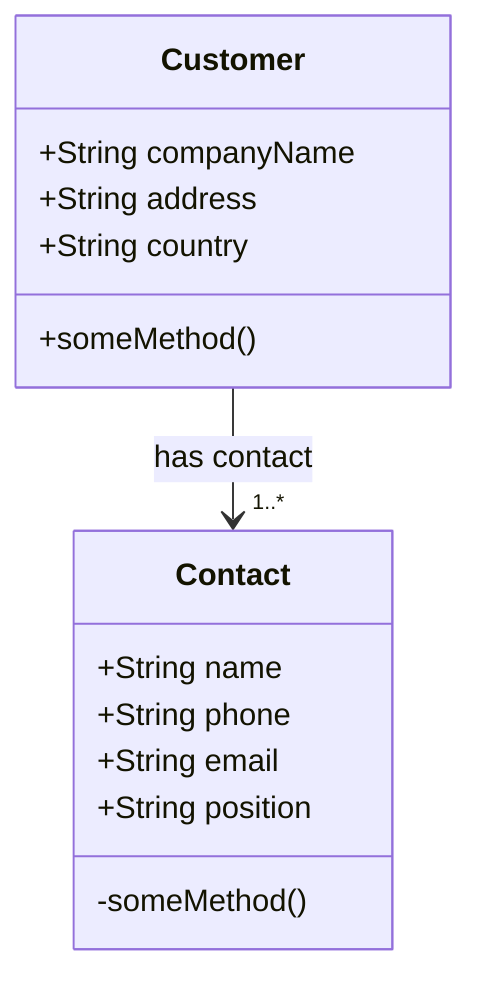

# csci318 Project

Online Ordering Application using a microservices architecture in Java Spring Boot.

 &nbsp;
&nbsp;
&nbsp;
&nbsp;
&nbsp;
&nbsp;
&nbsp;

---
### Demonstration

#### Return all customers
```bash
curl -X GET http://localhost:8080/customers
```
```JSON
[
  {
    "id": 1,
    "companyName": "Apple",
    "address": "1 Apple Park Way, Cupertino, CA 95014",
    "country": "USA",
    "contact": {
      "id": 2,
      "name": "Tim Apple",
      "phone": "123456",
      "email": "tim@apple.com",
      "position": "CEO"
    }
  },
  {
    "id": 3,
    "companyName": "SpaceX",
    "address": "42 Galactic Drive, San Francisco, CA 97468",
    "country": "USA",
    "contact": {
      "id": 4,
      "name": "Elon Musk",
      "phone": "69420",
      "email": "elon@spacex.com",
      "position": "CEO"
    }
  }
]
```


#### Return a specific customer
```bash
curl -X GET http://localhost:8080/customers/1
```
```JSON
{
  "id": 1,
  "companyName": "Apple",
  "address": "1 Apple Park Way, Cupertino, CA 95014",
  "country": "USA",
  "contact": {
    "id": 2,
    "name": "Tim Apple",
    "phone": "123456",
    "email": "tim@apple.com",
    "position": "CEO"
  }
}
```


#### Create a new customer
```bash
curl -X POST -H "Content-Type:application/json" -d '{"companyName":"Google","address":"1600 Amphitheatre Parkway, Mountain View, California","country":"USA","contact":{"name": "Test Testerson","phone": "0400000000", "email": "mail@example.com","position": "CEO"}}' http://localhost:8080/customers
```
```bash
curl -X GET http://localhost:8080/customers
```
```JSON
[
  {
    "id": 1,
    "companyName": "Apple",
    "address": "1 Apple Park Way, Cupertino, CA 95014",
    "country": "USA",
    "contact": {
      "id": 2,
      "name": "Tim Apple",
      "phone": "123456",
      "email": "tim@apple.com",
      "position": "CEO"
    }
  },
  {
    "id": 3,
    "companyName": "SpaceX",
    "address": "42 Galactic Drive, San Francisco, CA 97468",
    "country": "USA",
    "contact": {
      "id": 4,
      "name": "Elon Musk",
      "phone": "69420",
      "email": "elon@spacex.com",
      "position": "CEO"
    }
  },
  {
    "id": 5,
    "companyName": "Google",
    "address": "1600 Amphitheatre Parkway, Mountain View, California",
    "country": "USA",
    "contact": {
      "id": 6,
      "name": "Test Testerson",
      "phone": "0400000000",
      "email": "mail@example.com",
      "position": "CEO"
    }
  }
]
```


#### Update exisiting customer/contact
```bash
curl -X GET http://localhost:8080/customers/1
```
```JSON
{
  "id": 1,
  "companyName": "Apple",
  "address": "1 Apple Park Way, Cupertino, CA 95014",
  "country": "USA",
  "contact": {
    "id": 2,
    "name": "Tim Apple",
    "phone": "123456",
    "email": "tim@apple.com",
    "position": "CEO"
  }
}
```
```bash
curl -X PUT -H "Content-Type:application/json" -d '{"companyName": "Apple","address": "1 Apple Park Way, Cupertino, CA 95014","country": "USA","contact": {"id": 2,"name": "Tim Cook","phone": "123456","email": "tim@apple.com","position": "CEO}}' http://localhost:8080/customers/1
```
```bash
curl -X GET http://localhost:8080/customers/1
```
```JSON
{
  "id": 1,
  "companyName": "Apple",
  "address": "1 Apple Park Way, Cupertino, CA 95014",
  "country": "USA",
  "contact": {
    "id": 2,
    "name": "Tim Cook",
    "phone": "123456",
    "email": "tim@apple.com",
    "position": "CEO"
  }
}
```

---

### Architecture

- REST
- microservices

| Java Dependancies                                                                              |                               |
| ---------------------------------------------------------------------------------------------- | ----------------------------- |
| [Spring Web](https://mvnrepository.com/artifact/org.springframework/spring-web)                | RESTful web apps              |
| [Spring Data JPA](https://mvnrepository.com/artifact/org.springframework.data/spring-data-jpa) | allows persistant data as SQL |
| [H2 Database](https://mvnrepository.com/artifact/com.h2database/h2)                            | SQL database stored in-memory |

Classes:

<!-- generated by mermaid compile action - START -->


<details>
  <summary>Mermaid markup</summary>



</details>
<!-- generated by mermaid compile action - END -->

---

### Screenshots

Demo Site: [demo.example.com](demo.example.com)


