# csciXXX Project
 &nbsp;
&nbsp;
&nbsp;
&nbsp;

Online Ordering Application using a microservices architecture in Java Spring Boot.

**_Do not copy if you are in the same class, or you will fail._**

**Group Members**: ps484, mk507, aa541.

---

### System Documentation Contents

- [1. An introduction to the product](#system-documentation-1)
- [2. How to set up and run application](#system-documentation-2)
- [3. Technical design](#system-documentation-3)
  - [3.1 Domain models](#system-documentation-3-1)
  - [3.2 Architecture](#system-documentation-3-2)
    - [3.2.1 API Architecture](#system-documentation-3-2-1)
    - [3.2.2 Multi-tier Architecture](#system-documentation-3-2-2)
    - [3.2.3 Functionality of each Java class](#system-documentation-3-2-3)
    - [3.2.4 Java project structure](#system-documentation-3-2-4)
    - [3.2.4 Create Order Sequence](#system-documentation-3-2-5)
  - [3.3 Design patterns](#system-documentation-3-3)
- [4. API Documentation](#system-documentation-4)
  - [UseCase 1](#use-case-1) - Create Customer/Contact
  - [UseCase 2](#use-case-2) - Update Customer/Contact
  - [UseCase 3.1](#use-case-3-1) - Get Customer/Contact inf0
  - [UseCase 3.2](#use-case-3-2) - Get ALL Customer/Contact info
  - [UseCase 4](#use-case-4) - Create Product/Detail
  - [UseCase 5](#use-case-5) - Update Product/Detail
  - [UseCase 6.1](#use-case-6-1) - Get Product/Detail info
  - [UseCase 6.2](#use-case-6-2) - Get ALL Product/Detail info
  - [UseCase 7](#use-case-7) - Create Purchase
  - [UseCase 8](#use-case-8) - Get Customer info by Purchase
  - [UseCase 9](#use-case-9) - Get Product info by Purchase
  - [UseCase 10](#use-case-10) - Generate the total order quantity per product
  - [UseCase 11](#use-case-11) - Look up a list of products and the total order value for a customer

---

<a name="system-documentation-1"></a>

### 1. An introduction to the product

Is this my espresso machine? Wh-what is-h-how did you get my espresso machine? Must go faster... go, go, go, go, go! Yeah, but your scientists were so preoccupied with whether or not they could, they didn't stop to think if they should. Life finds a way.

---

<a name="system-documentation-2"></a>

### 2. How to set up and run application

Build: `./build.sh`
Run: `./run.sh`

- Honcho required as a dependency. To install: `pip install honcho;`

---

<a name="system-documentation-3"></a>

### 3. Technical design

<a name="system-documentation-3-1"></a>

#### Domain Models:


<!-- generated by mermaid compile action - START -->

<details>
  <summary>Mermaid markup</summary>

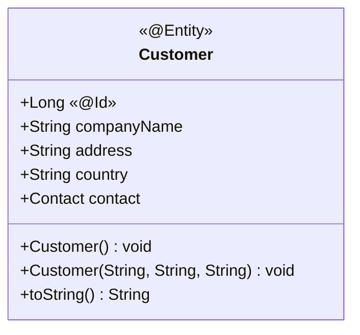

</details>
<!-- generated by mermaid compile action - END -->

<!-- generated by mermaid compile action - START -->

<details>
  <summary>Mermaid markup</summary>

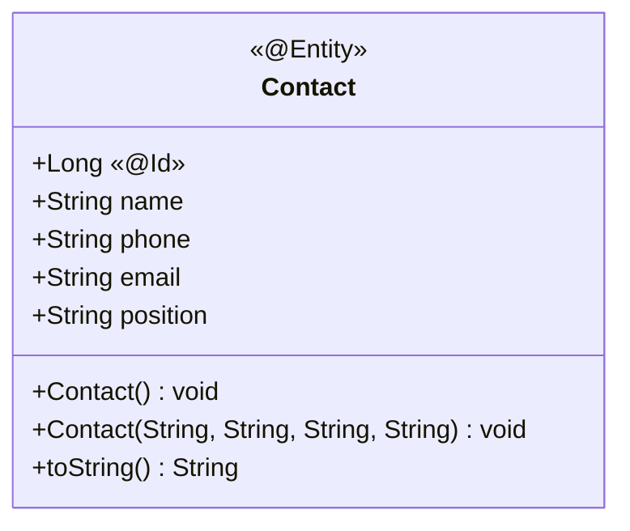

</details>
<!-- generated by mermaid compile action - END -->

<!-- generated by mermaid compile action - START -->

<details>
  <summary>Mermaid markup</summary>

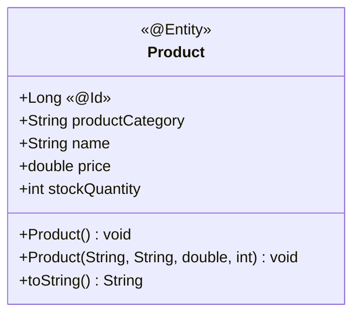

</details>
<!-- generated by mermaid compile action - END -->

<!-- generated by mermaid compile action - START -->

<details>
  <summary>Mermaid markup</summary>

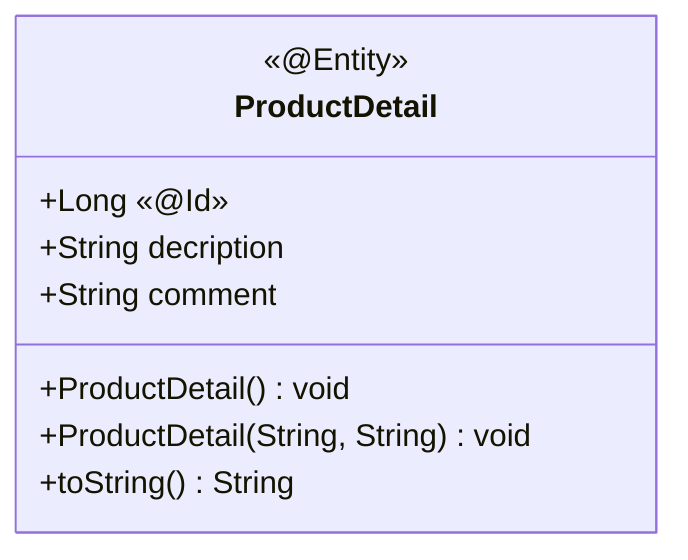

</details>
<!-- generated by mermaid compile action - END -->

<!-- generated by mermaid compile action - START -->

<details>
  <summary>Mermaid markup</summary>

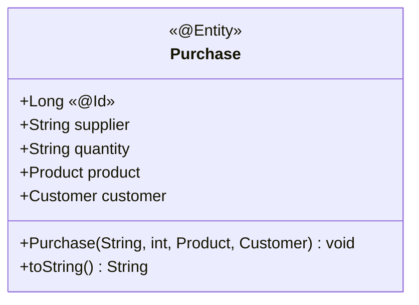

</details>
<!-- generated by mermaid compile action - END -->

<!-- generated by mermaid compile action - START -->

<details>
  <summary>Mermaid markup</summary>

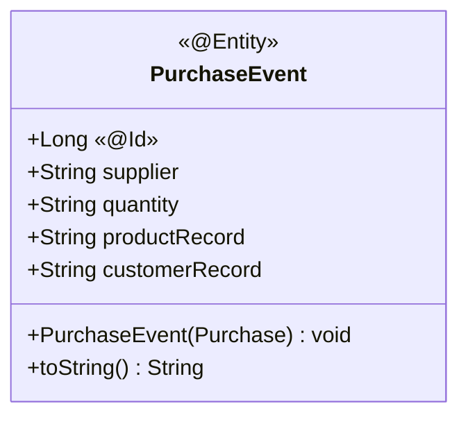

</details>
<!-- generated by mermaid compile action - END -->

---

<a name="system-documentation-3-2"></a>
<a name="system-documentation-3-2-1"></a>

#### API Architecture:

<!-- generated by mermaid compile action - START -->

<details>
  <summary>Mermaid markup</summary>

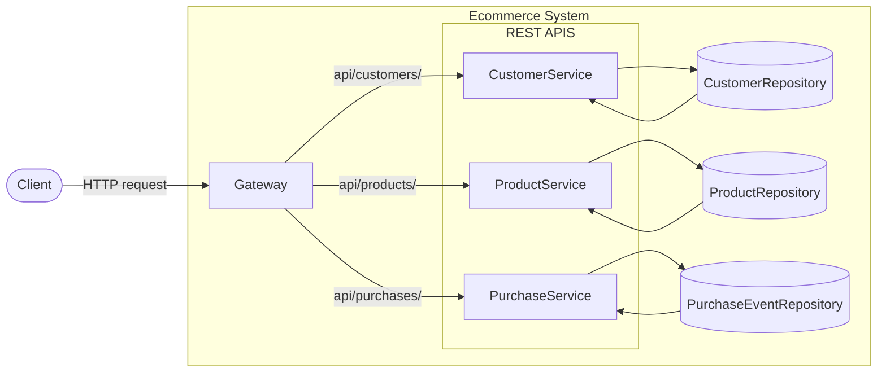

</details>
<!-- generated by mermaid compile action - END -->

---

<a name="system-documentation-3-2-2"></a>

#### Multi-tier architecture:

How the Java Classes map to the multi-tier architecture.

<!-- generated by mermaid compile action - START -->

<details>
  <summary>Mermaid markup</summary>

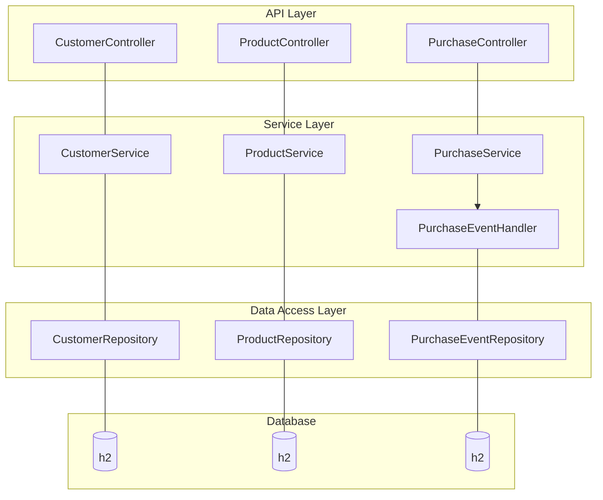

</details>
<!-- generated by mermaid compile action - END -->


<!-- generated by mermaid compile action - START -->

<details>
  <summary>Mermaid markup</summary>

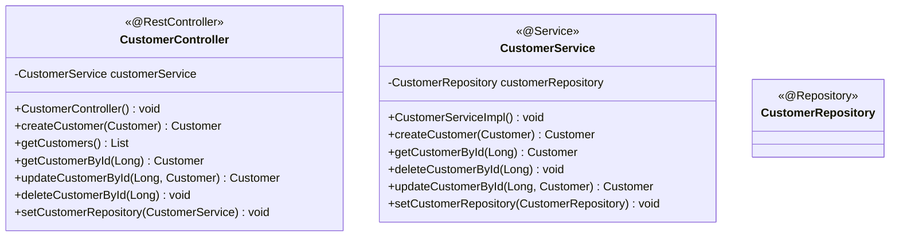

</details>
<!-- generated by mermaid compile action - END -->

<!-- generated by mermaid compile action - START -->

<details>
  <summary>Mermaid markup</summary>

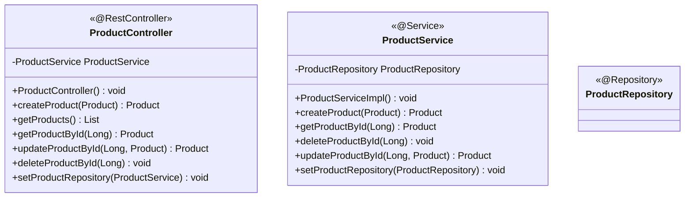

</details>
<!-- generated by mermaid compile action - END -->

<!-- generated by mermaid compile action - START -->

<details>
  <summary>Mermaid markup</summary>

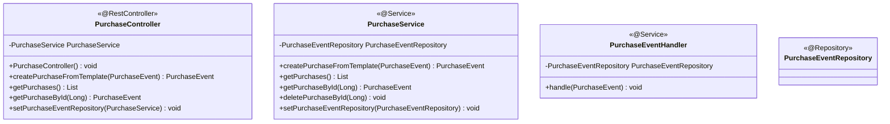

</details>
<!-- generated by mermaid compile action - END -->

---

<a name="system-documentation-3-2-3"></a>

#### Functionality of each Java class

| Java Dependancy                                                                                   | Purpose                               |
| ------------------------------------------------------------------------------------------------- | ------------------------------------- |
| [Spring Web](https://mvnrepository.com/artifact/org.springframework/spring-web)                   | RESTful web apps                      |
| [Spring Data JPA](https://mvnrepository.com/artifact/org.springframework.data/spring-data-jpa)    | allows persistant data as SQL         |
| [H2 Database](https://mvnrepository.com/artifact/com.h2database/h2)                               | SQL database stored in-memory         |
| [Jackson Databind]()                                                                              | Convert of JSON string to/from Object |
| [Spring Reactive Web](https://mvnrepository.com/artifact/org.springframework/spring-web-reactive) | Make REST requests programatically    |
| [Spring Cloud](https://mvnrepository.com/artifact/org.springframework.cloud)                      | Route http requests                   |

| Java Class                                          | Purpose                                                                                                                           |
| --------------------------------------------------- | --------------------------------------------------------------------------------------------------------------------------------- |
| [system-name]SystemApplication                      | Entry point to the application                                                                                                    |
| [system-name]Controller                             | Provides API functionality by handelling HTTP requests (GET, POST, PUT, DELETE)                                                   |
| [system-name]Service                                | Responsible for business logic and logic related to working with domain models                                                    |
| [system-name]Repository                             | Entends JpaRepository with the type of JpaRepository&lt;[system-name], Long&gt;                                                   |
| JpaRepository                                       | A library allowing persisting Java objects in relational databases. Allows instances of Classes to be stored in H2database as SQL |
| LoadDatabase                                        | Preloads database with test data on application startup                                                                           |
| Customer, Contact, Product, ProductDetail, Purchase | A Domain model                                                                                                                    |
| PurchaseEvent                                       | Encapsualtes the information of a state change as an event. (ie. a purchase was made)                                             |
| PurchaseTemplate                                    | Encapsulation of variables used to create a Purchase event                                                                        |
| PurchaseEventHandler                                | Subscribes to creation of events to performs actions to handle the event                                                          |

---

<a name="system-documentation-3-2-4"></a>

#### Java project structure:

```
src/main/java
  +- com
    +- csit318teamone
      +- CustomerSystem
        +- CustomerSystemApplication.java
          +- entities
            +- Customer.java
            +- Contact.java
          +- controllers
            +- CustomerController.java
          +- services
            +- CustomerService.java
            +- CustomerServiceImpl.java
          +- repositories
            +- CustomerRepository.java
          +- configuration
            +- LoadDatabase.java
```

```
src/main/java
  +- com
    +- csit318teamone
      +- ProductSystem
        +- ProductSystemApplication.java
          +- entities
            +- Product.java
            +- ProductDetail.java
          +- controllers
            +- ProductController.java
          +- services
            +- ProductService.java
            +- ProductServiceImpl.java
          +- repositories
            +- ProductRepository.java
          +- configuration
            +- LoadDatabase.java
```

```
src/main/java
  +- com
    +- csit318teamone
      +- PurchaseSystem
        +- PurchaseSystemApplication.java
          +- entities
            +- Customer.java
            +- Contact.java
            +- Product.java
            +- ProductDetail.java
            +- Purchase.java
            +- PurchaseDetail.java
            +- PurchaseEvent.java
            +- PurchaseTemplate.java
          +- controllers
            +- PurchaseController.java
          +- services
            +- PurchaseService.java
            +- PurchaseServiceImpl.java
            +- PurchaseEventHandler.java
          +- repositories
            +- PurchaseEventRepository.java
          +- configuration
            +- LoadDatabase.java
```

```
src/main/java
  +- com
    +- csit318teamone
      +- gateway
        +- GatewayApplication.java
```

---

<a name="system-documentation-3-2-5"></a>

#### Create Order Sequence:

<!-- generated by mermaid compile action - START -->

<details>
  <summary>Mermaid markup</summary>

```mermaid
sequenceDiagram
  participant ACTOR
  participant Purchase Service
  participant Customer Service
  participant Product Service
  ACTOR->>Purchase Service: POST /purchases/new
  Note right of ACTOR: body is JSON object with keys<br/>customerID, productID, quantity
  Purchase Service->>Customer Service: GET /customers/[customerID]
  Customer Service-->>Purchase Service: response
  Note left of Customer Service: body is JSON-Stringified Customer
  Purchase Service->>Product Service: GET /products/[productID]
  Product Service-->>Purchase Service: response
    Note left of Product Service: body is JSON-Stringified Product
  Purchase Service->>Purchase Service: << event >><br/>Order
  Purchase Service->>Product Service: PUT /products/[productID]
    Note right of Purchase Service: body is JSON-Stringified Product<br/> with updated stockQuantity
  Product Service-->>Purchase Service: response
  Purchase Service-->>ACTOR: response
```

</details>
<!-- generated by mermaid compile action - END -->

---

<a name="system-documentation-3-3"></a>

#### Domain Driven Design Patterns Justification:

Domain driven design is a software development paradigm which posits that functionality and logic surrounding a given application shall be described in terms of the business domain it satisfies. Most commonly used in combination with the object-oriented design methodology, domain driven design serves to map real world constructs and actions into those executed by a program. For example, a banking application might have domain models such as Account and Transaction, which have methods such as withdrawFunds or payAccount.

It is through these techniques that engineers are forced to consider and understand the business applications of the software they are creating. Since the inception of domain driven design, many tools and techniques have been developed to facilitate its use.

In developing this project, a number of these techniques have been adopted to remain in keeping with industry standards. These techniques include:

| Pattern         | Explaination                                                                                                                                                                                                                                                 | Example                                                                                                                                                                                                                                                                                 |
| --------------- | ------------------------------------------------------------------------------------------------------------------------------------------------------------------------------------------------------------------------------------------------------------ | --------------------------------------------------------------------------------------------------------------------------------------------------------------------------------------------------------------------------------------------------------------------------------------- |
| Entities        | A fundamental concept in domain driven design, entities are defined by their identity and existence rather than their respective attributes. We implemented a number of entities which are mapped to relational database tables by the Java Persistence API. | - Customer<br/>- Contact<br/>- Product<br/>- ProductDetail<br/>- Purchase                                                                                                                                                                                                               |
| Value Objects   | Value objects are defined solely by the attributes they contain. Any change to these attributes would mean the creation of a new object. Therefore, value objects must be immutable.                                                                         | The Purchase template contains a value objects productRecord and customerRecord which store json strings of the product and customer objects respectively. The records are value objects as two orders can have same value for a record, while the two records are not the same object. |
| Aggregates      | Aggregates are groups of interconnected entities and value objects that can be manipulated through a singular root access point. Aggregates are persisted as a whole, and shouldn’t share database transactions with other aggregates.                       | [Aggregates Diagram](#aggregates-diagram)                                                                                                                                                                                                                                               |
| Domain Services | A domain service contains the business logic that is enacted when entities are the object of an action rather than the subject.                                                                                                                              | One service has been implemented per aggregate.                                                                                                                                                                                                                                         |
| Repositories    | Used to decouple the access of a given entity from the way it is persisted.                                                                                                                                                                                  | One repository has been implemented per aggregate or standalone entity                                                                                                                                                                                                                  |
| Domain Events   | Domain events can be subscribed to by other sections of an application that wish to be notified of certain events.                                                                                                                                           | Used to update the quantity of a product after a purchase has taken place.                                                                                                                                                                                                              |
| Event Sourcing  | Event sourcing is a pattern that enables values to be stored not as a singular value, but as the entire history of events that led to a given state.                                                                                                         | This pattern is used to track the quantity of products.                                                                                                                                                                                                                                 |

<br/>
Aggregates Diagram:
<a name="aggregates-diagram"></a>

<!-- generated by mermaid compile action - START -->

<details>
  <summary>Mermaid markup</summary>

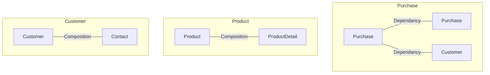

</details>
<!-- generated by mermaid compile action - END -->

---

<a name="system-documentation-4"></a>

### 4. API Documentation

<a name="use-case-1"></a>

#### Use Case 1: Create Customer/Contact

```bash
curl -X POST -H "Content-Type:application/json" -d \
'[JSON]' http://localhost:8080/customers
```

- where `JSON` is a JSON stringified customer object, to be added to the system

<br/>

**EXAMPLE:** Add `Google` as a new customer

```bash
curl -X POST -H "Content-Type:application/json" -d \
'{"companyName":"Google",
"address":"1600 Amphitheatre Parkway, Mountain View, California",
"country":"USA","contact":{"name": "Test Testerson","phone": "0400000000",
"email": "mail@example.com", "position": "CEO"}}' http://localhost:8080/customers
```

```bash
curl -X GET http://localhost:8080/customers
```

```JSON
[
  {
    "id": 1,
    "companyName": "Apple",
    "address": "1 Apple Park Way, Cupertino, CA 95014",
    "country": "USA",
    "contact": {
      "id": 2,
      "name": "Tim Apple",
      "phone": "123456",
      "email": "tim@apple.com",
      "position": "CEO"
    }
  },
  {
    "id": 3,
    "companyName": "SpaceX",
    "address": "42 Galactic Drive, San Francisco, CA 97468",
    "country": "USA",
    "contact": {
      "id": 4,
      "name": "Elon Musk",
      "phone": "69420",
      "email": "elon@spacex.com",
      "position": "CEO"
    }
  },
  {
    "id": 5,
    "companyName": "Google",
    "address": "1600 Amphitheatre Parkway, Mountain View, California",
    "country": "USA",
    "contact": {
      "id": 6,
      "name": "Test Testerson",
      "phone": "0400000000",
      "email": "mail@example.com",
      "position": "CEO"
    }
  }
]
```

---

<a name="use-case-2"></a>

#### Use Case 2: Update exisiting Customer/Contact

```bash
curl -X PUT -H "Content-Type:application/json" -d \
'[JSON]' http://localhost:8080/customers/[id]
```

- where `id` is the id of the customer
- where `JSON` is a JSON stringified customer object(Optionally with nested contact), to be updated in the system

<br/>

**EXAMPLE:** Update customer contact name of customer with id `1` from Tim **Apple** to Tim **Cook**

```bash
curl -X GET http://localhost:8080/customers/1
```

```JSON
{
  "id": 1,
  "companyName": "Apple",
  "address": "1 Apple Park Way, Cupertino, CA 95014",
  "country": "USA",
  "contact": {
    "id": 2,
    "name": "Tim Apple",
    "phone": "123456",
    "email": "tim@apple.com",
    "position": "CEO"
  }
}
```

```bash
curl -X PUT -H "Content-Type:application/json" -d \
'{"companyName": "Apple","address": "1 Apple Park Way, Cupertino, CA 95014",
"country": "USA", "contact": {"id": 2,"name": "Tim Cook","phone": "123456",
"email": "tim@apple.com", "position": "CEO}}' http://localhost:8080/customers/1
```

```bash
curl -X GET http://localhost:8080/customers/1
```

```JSON
{
  "id": 1,
  "companyName": "Apple",
  "address": "1 Apple Park Way, Cupertino, CA 95014",
  "country": "USA",
  "contact": {
    "id": 2,
    "name": "Tim Cook",
    "phone": "123456",
    "email": "tim@apple.com",
    "position": "CEO"
  }
}
```

---

<a name="use-case-3-1"></a>

#### Use Case 3.1: Get Customer/Contact info

```bash
curl -X GET http://localhost:8080/customers/[id]
```

- where `id` is the id of the customer

<br/>

**EXAMPLE:** Return customer with id `1`

```bash
curl -X GET http://localhost:8080/customers/1
```

```JSON
{
  "id": 1,
  "companyName": "Apple",
  "address": "1 Apple Park Way, Cupertino, CA 95014",
  "country": "USA",
  "contact": {
    "id": 2,
    "name": "Tim Apple",
    "phone": "123456",
    "email": "tim@apple.com",
    "position": "CEO"
  }
}
```

---

<a name="use-case-3-2"></a>

#### Use Case 3.2: Get ALL Customer/Contact info\

```bash
curl -X GET http://localhost:8080/customers
```

<br/>

**EXAMPLE:**

```bash
curl -X GET http://localhost:8080/customers
```

```JSON
[
  {
    "id": 1,
    "companyName": "Apple",
    "address": "1 Apple Park Way, Cupertino, CA 95014",
    "country": "USA",
    "contact": {
      "id": 2,
      "name": "Tim Apple",
      "phone": "123456",
      "email": "tim@apple.com",
      "position": "CEO"
    }
  },
  {
    "id": 3,
    "companyName": "SpaceX",
    "address": "42 Galactic Drive, San Francisco, CA 97468",
    "country": "USA",
    "contact": {
      "id": 4,
      "name": "Elon Musk",
      "phone": "69420",
      "email": "elon@spacex.com",
      "position": "CEO"
    }
  }
]
```

---

<a name="use-case-4"></a>

#### Use Case 4: Create Product/Detail

```bash
curl -X POST -H "Content-Type:application/json" -d \
'[JSON]' http://localhost:8080/products
```

- where `JSON` is a JSON stringified product object, to be added to the system
  <br/>

**EXAMPLE:** Add `Packham Pear` as a new product

```bash
curl -X POST -H "Content-Type:application/json" -d \
'{"productCategory":"Fruit","name":"Packham Pear","price":0.67,
"stockQuantity":200,"productDetail":{"description":
"Crispy white juicy sweet flesh, with a beautiful green skin which turns light yellow when ripe",
"comment":"Seasonality: March - December"}}' \
http://localhost:8080/products
```

```bash
curl -X GET http://localhost:8080/products
```

```JSON
[
  {
    "id": 1,
    "productCategory": "Fruit",
    "name": "Royal Gala Apple",
    "price": 0.62,
    "stockQuantity": 200,
    "productDetail": {
      "id": 2,
      "description": "Apples are juicy, crisp and come in a variety of colours including red, pink and green.",
      "comment": "Store your apples in the fridge"
    }
  },
  {
    "id": 3,
    "productCategory": "Fruit",
    "name": "Cavendish Banana",
    "price": 0.72,
    "stockQuantity": 200,
    "productDetail": {
      "id": 4,
      "description": "Bananas are perfect for snacking, used in baking, fruit salads and smoothies.",
      "comment": "Bananas are the worlds oldest fruit!"
    }
  },
  {
    "id": 5,
    "productCategory": "Fruit",
    "name": "Packham Pear",
    "price": 0.67,
    "stockQuantity": 200,
    "productDetail": {
      "id": 6,
      "description": "Crispy white juicy sweet flesh, with a beautiful green skin which turns light yellow when ripe",
      "comment": "Seasonality: March - December"
    }
  }
]
```

---

<a name="use-case-5"></a>

#### Use Case 5: Update Product/Detail

```bash
curl -X PUT -H "Content-Type:application/json" -d \
'[JSON]' http://localhost:8080/products/[id]
```

- where `id` is the id of the product
- where `JSON` is a JSON stringified product object(Optionally with nested productDetail), to be updated in the system

<br/>

**EXAMPLE:** Update customer contact name of customer with id `1` from Tim **Apple** to Tim **Cook**

```bash
curl -X GET http://localhost:8080/customers/1
```

```JSON
{
  "id": 1,
  "companyName": "Apple",
  "address": "1 Apple Park Way, Cupertino, CA 95014",
  "country": "USA",
  "contact": {
    "id": 2,
    "name": "Tim Apple",
    "phone": "123456",
    "email": "tim@apple.com",
    "position": "CEO"
  }
}
```

```bash
curl -X PUT -H "Content-Type:application/json" -d \
'{"companyName": "Apple","address": "1 Apple Park Way, Cupertino, CA 95014",
"country": "USA", "contact": {"id": 2,"name": "Tim Cook","phone": "123456",
"email": "tim@apple.com", "position": "CEO}}' http://localhost:8080/customers/1
```

```bash
curl -X GET http://localhost:8080/customers/1
```

```JSON
{
  "id": 1,
  "companyName": "Apple",
  "address": "1 Apple Park Way, Cupertino, CA 95014",
  "country": "USA",
  "contact": {
    "id": 2,
    "name": "Tim Cook",
    "phone": "123456",
    "email": "tim@apple.com",
    "position": "CEO"
  }
}
```

---

<a name="use-case-6-1"></a>

#### Use Case 6.1: Get Product/Detail info

```bash
curl -X GET http://localhost:8080/products/[id]
```

- where `id` is the id of the product

<br/>

**EXAMPLE:** Return product with id `1`

```bash
curl -X GET http://localhost:8080/products/1
```

```JSON
{
  "id": 1,
  "productCategory": "Fruit",
  "name": "Royal Gala Apple",
  "price": 0.62,
  "stockQuantity": 200,
  "productDetail": {
    "id": 2,
    "description": "Apples are juicy, crisp and come in a variety of colours including red, pink and green.",
    "comment": "Store your apples in the fridge"
  }
}
```

---

<a name="use-case-6-2"></a>

#### Use Case 6.2: Get ALL Product/Detail info

```bash
curl -X GET http://localhost:8080/products
```

<br/>

**EXAMPLE:**

```bash
curl -X GET http://localhost:8080/products
```

```JSON
[
  {
    "id": 1,
    "productCategory": "Fruit",
    "name": "Royal Gala Apple",
    "price": 0.62,
    "stockQuantity": 200,
    "productDetail": {
      "id": 2,
      "description": "Apples are juicy, crisp and come in a variety of colours including red, pink and green.",
      "comment": "Store your apples in the fridge"
    }
  },
  {
    "id": 3,
    "productCategory": "Fruit",
    "name": "Cavendish Banana",
    "price": 0.72,
    "stockQuantity": 200,
    "productDetail": {
      "id": 4,
      "description": "Bananas are perfect for snacking, used in baking, fruit salads and smoothies.",
      "comment": "Bananas are the worlds oldest fruit!"
    }
  }
]
```

---

<a name="use-case-7"></a>

#### Use Case 7: Create Purchase

```bash
curl -X POST -H "Content-Type:application/json" -d \
'{"quantity":[QTY],"productID":[PID], "customerID":[CID]}' \
http://localhost:8080/purchases/new
```

- where `QTY` is the amount of products purchased
- where `PID` is the id of the product
- where `CID` is the id of the customer

<br/>

**EXAMPLE:** Add a new purchase of `1` units, of product with id `1`, by customer with id `1`

```bash
curl -X POST -H "Content-Type:application/json" -d \
'{"quantity":1,"productID":1, "customerID":1}' \
http://localhost:8080/purchases/new
```

---

<a name="use-case-8"></a>

#### Use Case 8: Get Customer info by Purchase

```bash
curl -X GET http://localhost:8080/purchases/[id]
```

- where `id` is the id of the purchase

<br/>

**EXAMPLE:** Return purchase with id `1`

```bash
curl -X GET http://localhost:8080/purchases/1
```

```JSON
{
  "id": 1,
  "supplier": null,
  "quantity": 1,
  "productRecord": "{\"id\":1,\"productCategory\":\"Fruit\",\"name\":\"Royal Gala Apple\",\"price\":0.62,\"stockQuantity\":200,\"productDetail\":{\"id\":null,\"description\":\"Apples are juicy\",\"comment\":\"Store your apples in the fridge\"}}",
  "customerRecord": "{\"id\":1,\"companyName\":\"Apple\",\"address\":\"1 Apple Park Way, Cupertino, CA 95014\",\"country\":\"USA\",\"contact\":{\"id\":null,\"name\":\"Tim Apple\",\"phone\":\"123456\",\"email\":\"tim@apple.com\",\"position\":\"CEO\"}}"
}

```

---

<a name="use-case-9"></a>

#### Use Case 9: Get Product info by Purchase

```bash
curl -X GET http://localhost:8080/purchases/[id]
```

- where `id` is the id of the purchase

<br/>

**EXAMPLE:** Return purchase with id `1`

```bash
curl -X GET http://localhost:8080/purchases/1
```

```JSON
{
  "id": 1,
  "supplier": null,
  "quantity": 1,
  "productRecord": "{\"id\":1,\"productCategory\":\"Fruit\",\"name\":\"Royal Gala Apple\",\"price\":0.62,\"stockQuantity\":200,\"productDetail\":{\"id\":null,\"description\":\"Apples are juicy\",\"comment\":\"Store your apples in the fridge\"}}",
  "customerRecord": "{\"id\":1,\"companyName\":\"Apple\",\"address\":\"1 Apple Park Way, Cupertino, CA 95014\",\"country\":\"USA\",\"contact\":{\"id\":null,\"name\":\"Tim Apple\",\"phone\":\"123456\",\"email\":\"tim@apple.com\",\"position\":\"CEO\"}}"
}

```

---

<a name="use-case-10"></a>

#### Use Case 10: Get the total order quantity for a product

```bash
curl -X GET http://localhost:8183/brand/[product_id]/quantity
```

- where `product_id` is the id of the product

<br/>

**EXAMPLE:** Return product with id `1`

```bash
curl -X GET http://localhost:8183/brand/1/quantity
```

```JSON
6
```

---

<a name="use-case-11"></a>

#### Use Case 11: Look up a list of products and the total order value for a customer

```bash
curl -X GET http://localhost:8183/brand/1/quantity
6
```

- where `c` is the customer-id

<br/>

**EXAMPLE:** Return list of products and the total order value customer with id `1`

```bash
echo 'some command';
```

```JSON
{
"some": "JSON"
}
```
